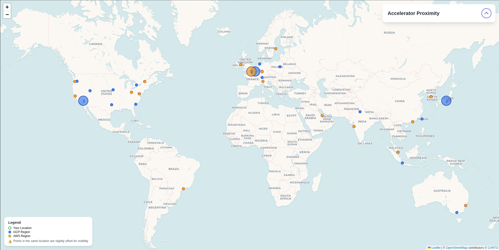

# Cloud Accelerator Proximity Map

An interactive web-based tool to visualize the proximity of major cloud provider GPU and accelerator data centers to your own locations. This map helps you find the closest cloud regions with specific accelerator hardware, making it easier to plan for low-latency deployments.



## Features

- Interactive World Map: Visualize global data center locations from Google Cloud (GCP) and Amazon Web Services (AWS).
- Filtering by Provider or Accelerator: Display locations for all providers, or focus specifically on GCP or AWS.
- Custom User Locations: Add your own data center or user locations by pasting a simple JSON object to find the nearest cloud regions.
- Proximity Calculation: Click on one of your locations to instantly see a ranked list of the 5 closest cloud regions that match your filters, complete with distances in kilometers.
- Shareable State: The current view—including selected provider, accelerator types, and your custom locations—is encoded in the URL. Simply copy the URL to share your exact configuration with others.

## Add Your Locations

1. Expand the Your Locations section.
2. Paste a JSON object containing your locations into the text area. The required format is an object where keys are location names and values are objects with lat and lng properties.
3. Click the Update Map button. Your locations will appear on the map as green rings.
4. Select any of your DCs to see the closest regions.

Example:
```json
{
  "Frankfurt, DE": {
    "lat": 50.1109,
    "lng": 8.6821
  },
  "London, UK": {
    "lat": 51.5074,
    "lng": -0.1278
  },
  "San Francisco, US": {
    "lat": 37.7749,
    "lng": -122.4194
  },
  "Singapore": {
    "lat": 1.3521,
    "lng": 103.8198
  }
}
```


## Data Sources

1. GCP: [GPU regions and zones](https://cloud.google.com/compute/docs/gpus/gpu-regions-zones).
2. AWS: [Amazon EC2 instance types by Region](https://docs.aws.amazon.com/ec2/latest/instancetypes/ec2-instance-regions.html).
3. Azure: [Product Availability Per Region](https://azure.microsoft.com/en-us/explore/global-infrastructure/products-by-region/table).

> [!NOTE]
> Coordinates represent the approximate center of the region or its reference city as listed in the official documentation.
> Data was last updated Feb 2026.
