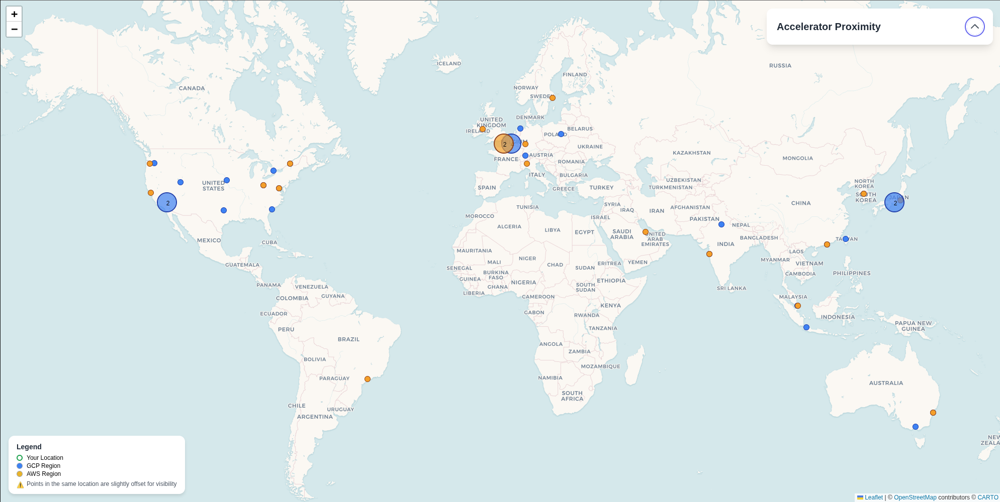

# Cloud Accelerator Proximity Map

[Link](https://cloud-accelerator-map.pages.dev/)

An interactive web-based tool to visualize the proximity of major cloud provider GPU and accelerator data centers to your own locations. This map helps you find the closest cloud regions with specific accelerator hardware, making it easier to plan for low-latency deployments.



## Features

- Interactive World Map: Visualize global data center locations from Google Cloud (GCP), Amazon Web Services (AWS), and Microsoft Azure.
- Filtering by Provider or Accelerator: Display locations for all providers, or focus on a specific cloud or accelerator family.
- Custom User Locations: Add your own data center or user locations by pasting a simple JSON object to find the nearest cloud regions.
- Proximity Calculation: Adding locations immediately shows the 5 closest matching cloud regions. Switch with the location selector or a green marker. Distances are approximate straight-line kilometers, not measured network latency.
- Shareable State: The current view—including selected provider, accelerator types, and your custom locations—is encoded in the URL. Simply copy the URL to share your exact configuration with others.

## Add Your Locations

1. Open the Your Locations tab.
2. Paste a JSON object keyed by location name. Coordinates must be numbers: `lat` between -90 and 90, and `lng` (or `lon`) between -180 and 180.
3. Click Update Map. Green markers appear and proximity results open for the first location (or your previously selected location if it still exists).
4. Use Find regions near or click a green marker to select another location. Compare All Locations gives the nearest matching region per provider.

Only applied, validated locations are saved in the URL; invalid edits leave your previous map intact. Shared URLs contain your location names and coordinates, so share them only with intended recipients.

Example:
```json
{
  "Frankfurt, DE": {
    "lat": 50.1109,
    "lng": 8.6821
  },
  "London, UK": {
    "lat": 51.5074,
    "lng": -0.1278
  },
  "San Francisco, US": {
    "lat": 37.7749,
    "lng": -122.4194
  },
  "Singapore": {
    "lat": 1.3521,
    "lng": 103.8198
  }
}
```

## Basemap

The map uses OpenStreetMap standard tiles with visible attribution, normal browser caching, and an origin-only cross-origin referrer. CARTO's formerly keyless endpoint now returns "API key required" tiles, so it is no longer the default. Use is limited to normal interactive viewing under the [OSM tile usage policy](https://operations.osmfoundation.org/policies/tiles/): no prefetch, bulk downloads, or offline tiles. The public service has no SLA; a high-traffic deployment should use a suitably provisioned tile provider.

## Proximity Regression Tests

Run `node --test tests/test_map.js` with Node.js 22 or newer. These dependency-free tests run the page's actual script and event handlers with DOM/Leaflet doubles, covering coordinate validation, `lon` normalization, automatic selection, marker/selector switching, sorted distances, category reset, saved-link restoration, escaped location names, and visible provider-load failures. They do not replace visual browser checks or test live tile delivery.


## Data Sources

1. GCP: [GPU regions and zones](https://docs.cloud.google.com/compute/docs/regions-zones/gpu-regions-zones).
2. AWS: [Amazon EC2 instance types by Region](https://docs.aws.amazon.com/ec2/latest/instancetypes/ec2-instance-regions.html).
3. Azure: [Product Availability Per Region](https://azure.microsoft.com/en-us/explore/global-infrastructure/products-by-region/table).

> [!NOTE]
> Coordinates represent the approximate center of the region or its reference city as listed in the official documentation.
> Data was last updated October 2026. AWS GovCloud is intentionally outside the map's public/commercial cloud scope.

## Refreshing Provider Data

The updater fetches all three official provider sources, validates the complete result, and only then replaces the generated JSON files. It backs up the prior generation and restores it if publishing any provider file fails. Region coordinates and canonical labels live in `region_metadata.json`, so a newly launched provider region stops the refresh with a clear metadata error instead of producing a partial map.

```bash
python -m venv .venv
. .venv/bin/activate
pip install -r requirements.txt
python -m unittest discover -s tests
python scrape_data.py
```

Azure records retain the map's display slug in `region` and expose Azure's canonical programmatic name in `region_id` (for example, `east-us-2` and `eastus2`).

Microsoft documents the ND GB200 v6 and ND GB300 v6 families, but the map does not assign them to regions until Microsoft's product-availability source reports a dependable GA region mapping.

Pull requests and a monthly scheduled GitHub Actions run execute the same tests and refresh. The refreshed `aws.json`, `azure.json`, and `gcp.json` files are attached to the workflow run as an artifact for review, and the job fails if those generated files differ from the committed snapshot.
